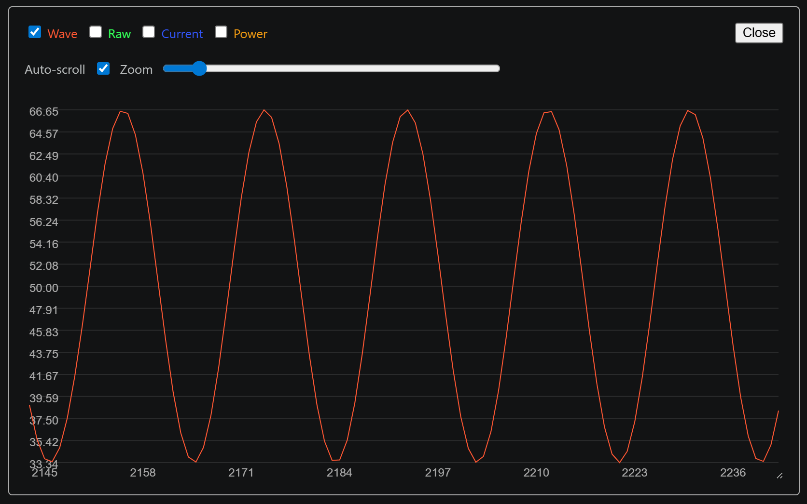
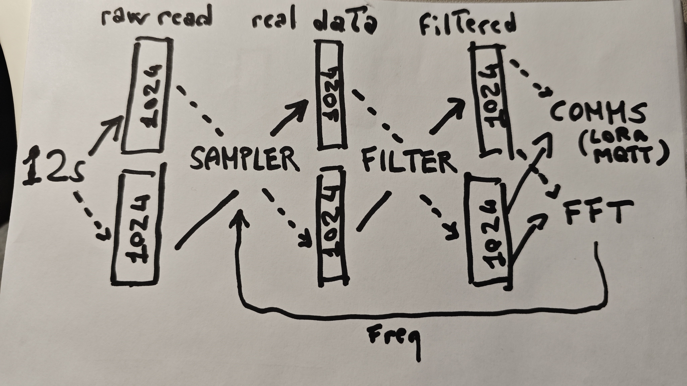
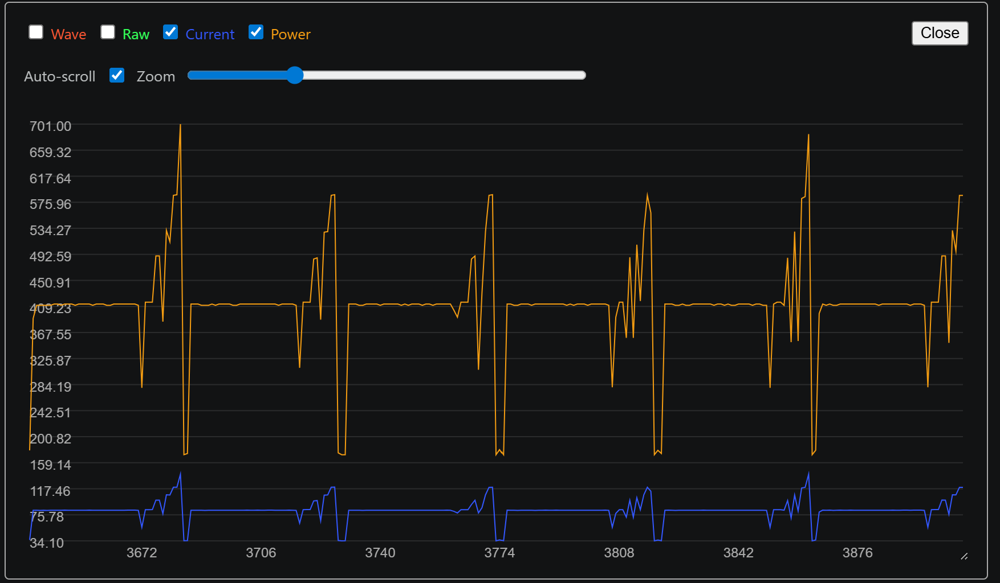
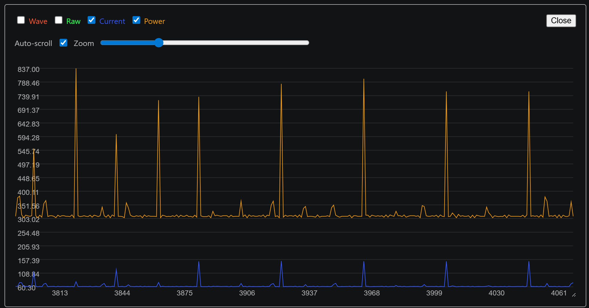
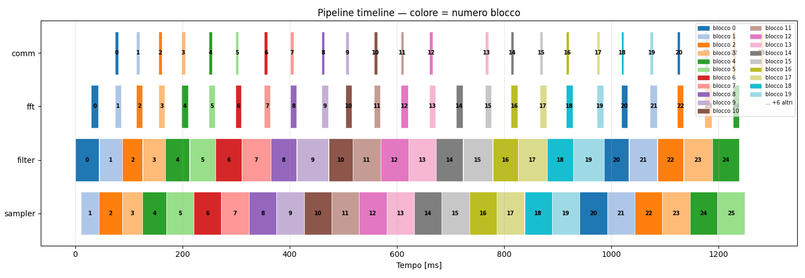

# Iot Project

## Abstract
This repository contains firmware for an IoT sensing node built for the
Internet of Things Algorithms and Services course (Sapienza University of Rome,
A.Y. 2025/2026).

The main idea is simple:

- sample a signal on-device
- process it locally with filtering and FFT
- transmit compact statistics instead of raw data
- adapt sampling behavior to reduce energy and network usage

The project uses FreeRTOS tasks on ESP32 and supports two uplink modes:

- MQTT over WiFi
- LoRaWAN (ABP) on TTN

## What is in this project

There are two firmware targets in `platformio.ini`:

- `nodemcu-32s` or `heltec_wifi_lora_32_V3`: the sensing node (sampler,
  filter, FFT, communication)
- `raspberry-pi-pico`: signal generator + power monitor firmware
  (`src/generator_monitor.cpp`)

## Materials
- 1 ESP32 Heltec V3 Lora, for LoRa functionalities
- 1 ESP32-WROOM-32 
- 1 INA219 
- 1 raspberry pi pico
- 1 small breadboard
- 1/2 100 microOhm resistors
- 1 10 microFarahd condenser
- plenty of wires
- 1 tin cookie box for DIY Faraday cage (doesn't work)

---

## Structure

We have two main components, and their respective builds can be found in the platformio.ini file:
- the **Esp32**(s) contain the parts you will find in most IoT devices: the **Sampler**, the **Filter**, the **FFT** and the **Communications**
- the **Raspberry Pi Pico** instead works as the **Signal generator** and **Energy monitor**

### Signal generation
Raspberry pi Pico utilises PWM library to generate the requested sinusoid (single or sum of multiple waves), at a frequency of 10.000 hz, and on demand, injects gaussian and/or spiky noise

The pwm signal is semi-analog, this means it outputs a square wave of voltage, so to transform it in analog we pass the signal through an RC lowpass filter, with the condenser and resistor, before reaching the adc pin 32 on the Esp

### Pipeline
The Esp boasts a robust pipeline, utilizing a chain series of three double-buffers, all of 1024 samples, for near-continuous processing. Each component works on the data passed on from the previous task and passes it to the next worker. As standard double-buffer pipeline, each task fills one of the double-buffers while previous and next tasks work on the filled

#### Sampler task and maximum frequency
The sampler uses the built-in i2s hardware of the Esp (only WROOM), which uses DMA to directly sample from the adc pin and put it in memory. I2s is designed for sound, so it can sample higher than 44.100 hz. Then the sampler casts and copies appropriately My experiments showed that without sending data with lora or mqtt, the pipeline easily can withstand frequencies higher than 10.000 hz, also 15.000 hz, but this introduces numerous problems, so we start from an arbitrary 1.000 hz.

#### Filter task
The filter takes the filled buffer given from the sampler and can:
- do nothing
- compute z-score
- compute hampel
because it uses a full block to work on and not a continuous flow of samples, sliding window filters are  penalised as they use the previous samples to calculate, so we use an **history** buffer that saves the last WINDOW_SIZE components of the block, to use in the next one

#### FFT task
This task always runs computes the Fast-Fourier Transform on the filtered block, tries to find the highest frequency with the highest amplitude (so it is present in the signal) and if its not too similar with the current one, sets it as the global frequency. It takes a staggering few microseconds to compute

#### Comms task
The filtered buffer is averaged, std over the entire 1024 samples array, so it's 1024/{current sampling frequency} seconds. WE gathered data can be transmitted via WiFi using MQTT (on a private broker) and LoRa (on TTN). A set flag will choose if LoRa or MQTT is used, located in the header file, both WiFi and LoRa can be enabled/disabled to replicate all the experiments.

### Performance
#### Energy
Let' measure the energy while oversampling, powered by usb

As you can see the power consumption is very high, averiging **410 mW** and **76 mA**. The esp never sleeps and performs all the pipeline

Let's see the adaptive sampling

Now we see an average of **300 mW** and **60mA**, with respectively a 25% and 21% savings

#### RTTs
These are printed snippets from the program

##### LoRa
We use the RadioLib library and connected to LoraWAN with ABP initialization, this requires settings manually your keys taking them from TTN. We send 4 bytes, we have to wait more than 18 seconds before the next packet
[LoRa] Sending packet 1...
[LoRa] Uplink OK (no downlink) | AVG: 1886.99 | Latency: 2871 ms
[LoRa] Waiting duty-cycle window: 18058 ms
[LoRa] Sending packet 2...
[LoRa] Uplink OK (no downlink) | AVG: 1885.00 | Latency: 2863 ms
[LoRa] Sending packet 3...
[LoRa] Uplink OK (no downlink) | AVG: 1885.87 | Latency: 2863 ms

##### MQTT
We use the SubPubLibrary to connect to the Mosquitto Broker installed on my PC (requires a little bit of setup: opening the firewall, allowing anonymous clients, script to send responses on publish), connect to the wifi of my cellphone.
1776943053: Sending PUBLISH to ESP32Client (d0, q0, r0, m0, 'iot_single/response', ... (56 bytes))
1776943053: Received PUBLISH from ESP32Client (d0, q0, r0, m0, 'iot_single/stats', ... (56 bytes))
1776943053: Sending PUBLISH to auto-856FDC9D-0D2D-3404-8A3F-AA822E8D00C0 (d0, q0, r0, m0, 'iot_single/stats', ... (56 bytes))

**rtt**: 5.273 ms

#### End to End
Due to the array structure it isnt possible to time the exact time from when a sample is extracted and when it's averaged and send, but we can time every iteration for every task, and plot the pipeline in action on the time domain, to see how much time on average each block of 1024 sample is processed by each task

This is an ideal plot that shows best how a task sends the processed buffer to the next one, but its not perfect, block 0 of sampler is never logged.

We can see how every task elaborates a block and passes it to the next one. Here are the average executions:

  sampler       47.55 ms
  filter        49.02 ms
  fft           12.00 ms
  comm           5.71 ms
  sum          114,24 ms

